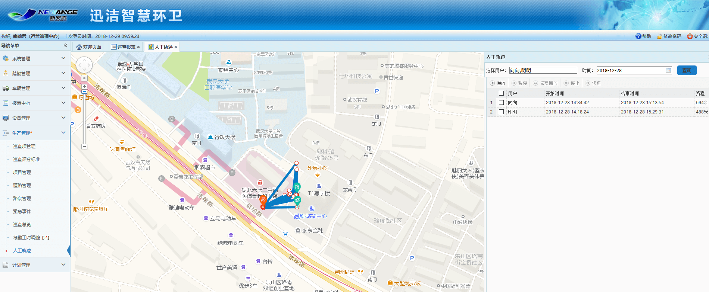
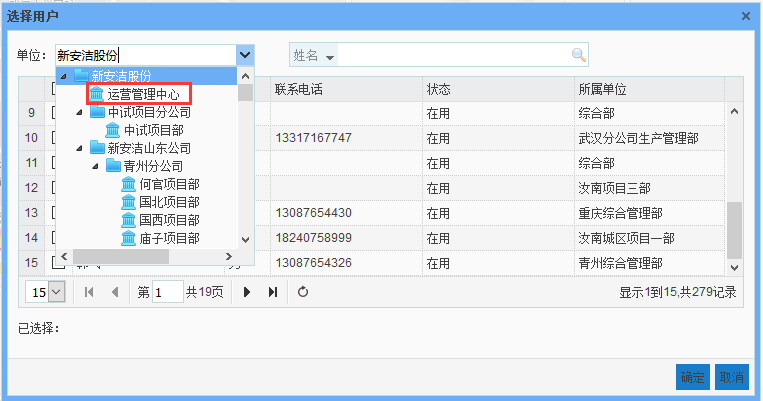
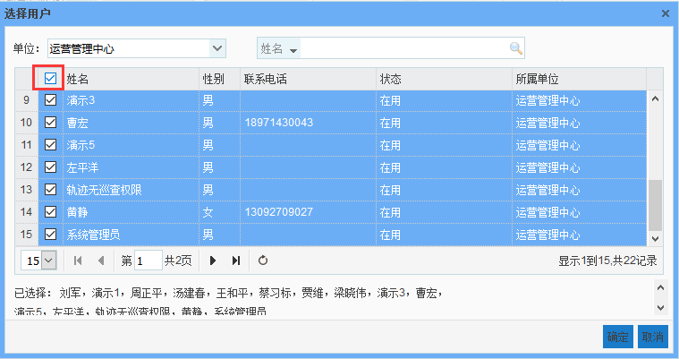

* **人工轨迹**
             
可以查看所有人人员的轨迹，前提是用户登录了迅洁app。可以同时展现多个人的轨迹。
针对具备多级巡查权限的人员：上班时间（8:00-5:30）的轨迹。
针对具备作业巡查权限的班组长：与计划挂钩的作业时段内的轨迹。
无巡查权限的人员：上班时间（8:00-5:30）的轨迹。
查询步骤：点击选择用户输入框，选择要查询的人员，选择起止时间，点击查询即可。
右侧列表选中一条数据后，地图上才会出现相应的轨迹，点击播放，地图上的小人开始按照轨迹行走，可以点击快进进行加速。
注意：巡查轨迹是10分钟上传一个定位点，将期间的定位点连接成轨迹，故轨迹可能存在不精确，稍有偏差都是正常现象。

说明：如果用户想要查看一个部门下所有人的轨迹，操作步骤如下：点击选择用户，会弹出选择用户的提示框，在单位的下拉框里选择某一个部门，则列表只显示该部门或者该项目部的所有人员，点击姓名左侧的复选框，即可全选当前页面的所有用户，点击确定，再点击查询，地图上即可展示所选人员的轨迹。

