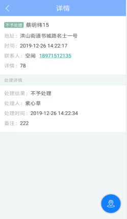
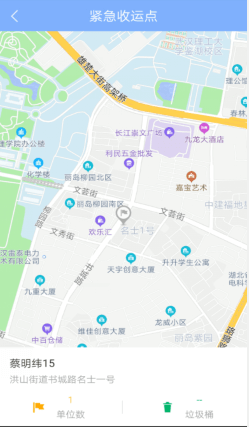

**会员服务app**
合作方在微信小程序上发布紧急收运请求和意见反馈后，作业方可以在【会员服务】模块中收到请求信息和意见反馈信息，对信息进行查看和处理。
* **紧急收运**
点击【会员服务】- 跳转至【紧急收运】页面 - 可查看当前部门下所有合作方上报的紧急收运请求和处理情况 - 选中待处理的紧急收运请求，点击【处理】- 选中【已处理或不予处理】，填写备注 - 点击【提交】按钮 - 已处理的紧急收运请求的状态变更为：【已处理或不予处理】。
点击【蓝色】按钮 - 可跳转至地图页面，查看紧急收运点的名称、单位数、垃圾桶数和地址
注：上报的紧急收运请求需要在12小时内处理，超过12个小时，待处理的紧急收运请求会变更为：已过期的状态，则无法处理
APP端和web端都会同显示
紧急收运的四种状态：待处理，已处理，已过期，不予处理
合作方上报紧急收运请求后的12个小时内，紧急收运的状态为：待处理
作业方处理完紧急收运请求后，紧急收运的状态为：已处理
合作方上报的紧急收运请求在12小时内没有被处理时，紧急收运的状态会变更为：已过期
作业方处理紧急收运请求时，认为不需要处理时，紧急收运的状态为：不予处理。

* **意见反馈**
**待处理**
点击【意见反馈】按钮 - 可跳转至【待处理】页面 - 可查看当前部门下所有合作方上报的意见反馈信息 - 选中【意见反馈】- 点击【处理】按钮 - 弹出【处理反馈意见对话框】- 填写内容，点击【提交】- 处理后的意见反馈将自动跳转至【已处理】页面

**已处理**
点击【已处理】按钮 - 可跳转至【已处理】页面 - 可查看当前部门下所有合作方上报并处理过的意见反馈信息 - 点击【查看】按钮 - 可查看处理结果 - 点击【收起】- 可将处理结果隐藏起来。
