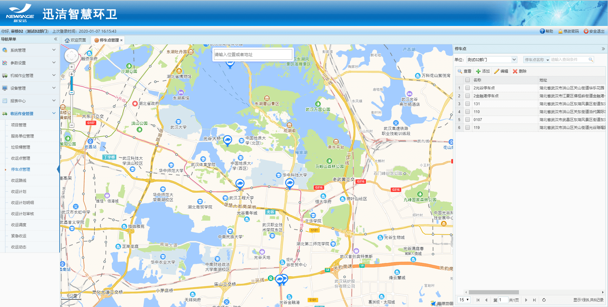
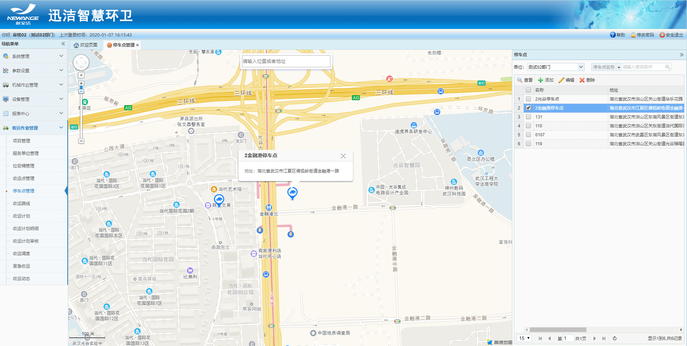
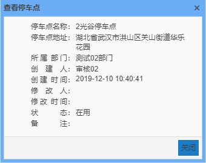
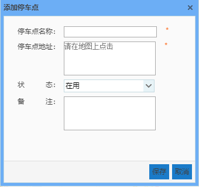
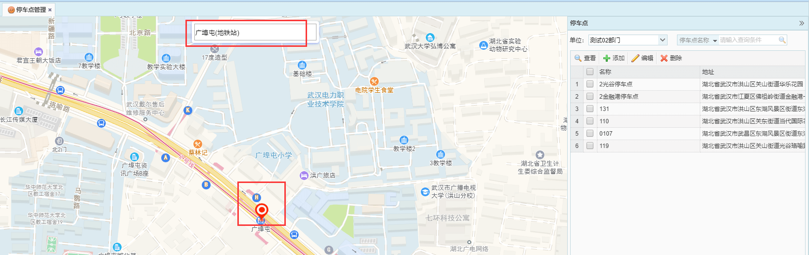
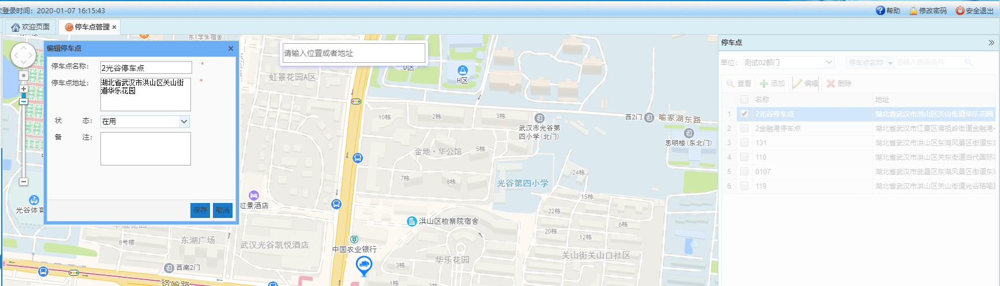

停车点管理：1.在地图上展示项目的停车点位置，可以根据单位、停车点名称或者停车点地址进行查询；
2.有添加、编辑、查看、删除功能；
3.建议一个部门创建两个停车点，分别作为收运路线的起点和终点。目前收运路线的起点和终点不能是同一个停车点。
4.地图搜索框搜索地址，可以快速定位到该位置，快速添加停车点；
5.右侧列表选中一个停车点，左侧地图自动定位到该停车点并展示停车点的信息框，信息框中显示停车点名称和地址。
注意：停车点是部门专属，其他部门的停车点，本部门下的项目的收运路线不能使用。

* **查看停车点**
显示该停车点的名称、地址、所属部门、创建时间、修改人、修改时间、状态、备注。

* **添加停车点**
点击添加，输入名称、在地图上点击标注位置，点击保存即可。也可在搜索框输入地址，快速定位到该点。

* **编辑停车点**
可以修改名称、在地图上拖动图标位置来修改地址。

* **编辑停车点**
可以修改名称、在地图上拖动图标位置来修改地址。
* **删除停车点**
选中一个停车点，点击删除即可。
