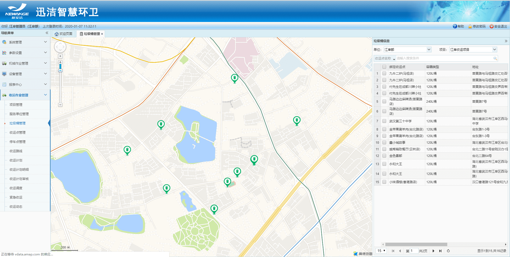
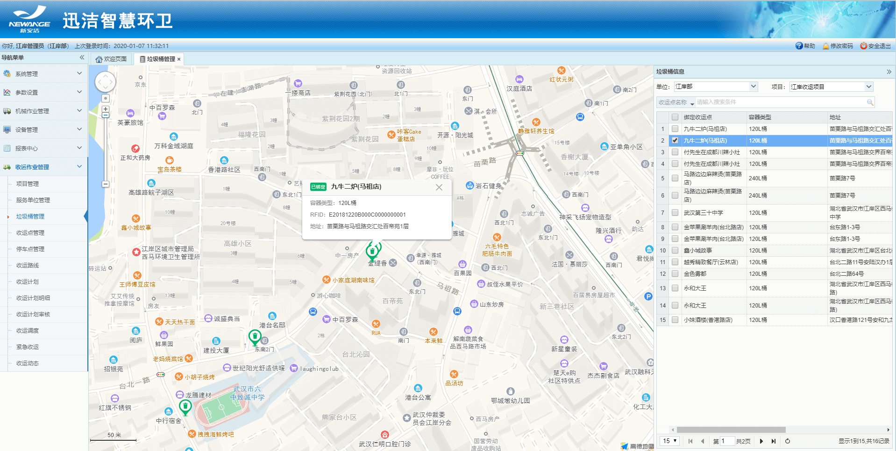

垃圾桶管理：
1.在地图上展示垃圾桶的位置，右侧列表展示垃圾桶的容器类型、所绑定的收运点、地址和RFID编号；
2.可根据单位、项目、收运点名称、RFID编号来查询垃圾桶；
3.右侧选中一个垃圾桶，左侧地图自动定位该垃圾桶并且展示垃圾桶的信息框：容器类型、RFID编号、地址。
注意：
1.垃圾桶的状态一共有3种：在用、闲置、废弃。web端只显示在用状态的垃圾桶。
2.垃圾桶的状态仅在迅洁app端【收运点管理】模块进行修改。

