**我的信息**
合作方登录后，可在【我的信息】中，查看个人的单位详情和签约详情，可对单位详情信息进行编辑，并对签约详情中的责任人进行添加并删除，同时还可以对作业方提出不用的意见反馈，通过反馈记录，来跟踪处理结果。
注：责任人至少得保留一位，不可全部删除，被删除的责任人不可再次登录微信小程序
当合约到期后，只能对单位详情信息进行编辑，无法添加责任人或删除责任人，也无法上报意见反馈。
* **详情**
点击【我的信息】- 跳转至【我的信息】页面 - 可查看已签约或已过期的合作单位的信息 - 点击【详情】按钮 - 跳转至【单位详情】页面 - 可查看服务单位的基本信息和经营信息。
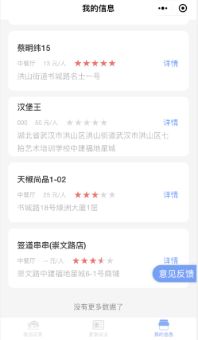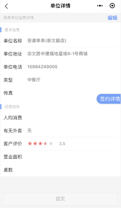
* **编辑**
选中一条【服务单位】- 点击【详情】按钮- 跳转至【单位详情】页面 - 可查看服务单位的基本信息和经营信息 - 点击【编辑】按钮 - 对【单位详情】的信息进行编辑 - 点击【提交】按钮 - 即可对单位的详情修改成功
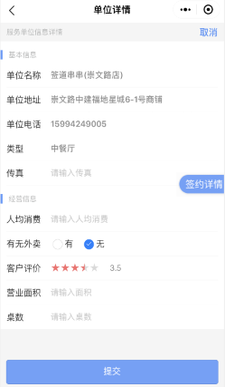
* **签约详情**
选中一条【服务单位】- 点击【详情】按钮- 跳转至【单位详情】页面 - 可查看服务单位的基本信息和经营信息 - 点击【签约详情】按钮 - 跳转至【签约详情】页面 - 可查看该签约单位的布桶时段、合同有效期、责任人和联系方式等信息 - 点击【添加责任人】- 弹出【添加责任人对话框】- 填写【责任人的姓名和联系方式】- 点击【确定】- 即可添加责任人成功
选中某个责任人 - 点击【删除】按钮 - 弹出【确认框】- 点击【确定】按钮 - 即可删除该责任人
注：当选中的【服务单位】合约已到期，点击【签约详情】后，【签约详情】页面会提示：该服务单位签约已过期，同时无法对签约详情页面做任何操作，只能查看
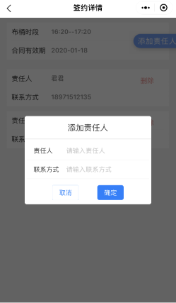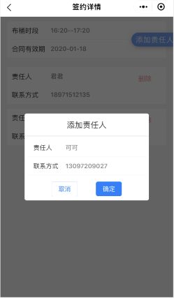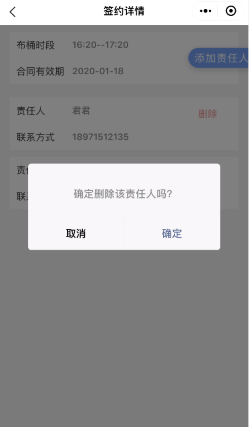!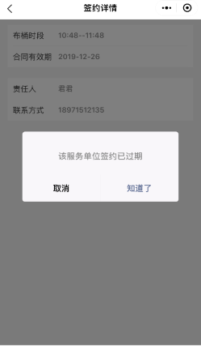
* **意见反馈**
点击【我的信息】- 跳转至【我的信息】页面 - 点击【意见反馈】- 跳转至【意见反馈】页面 - 可查看签约服务单位的名称和地址 - 点击【单位名称】- 选中需要上报的【服务单位】- 点击【确定】按钮 - 填写【反馈内容】- 点击【提交】按钮 - 即可成功上报意见反馈
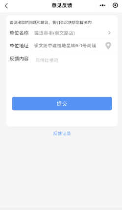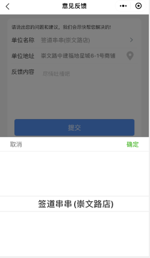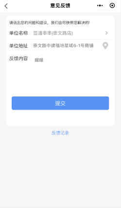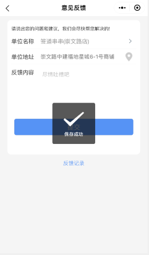
* **反馈记录**
合作方上报【意见反馈】后，可在【反馈记录】页面，查看待处理和已处理的意见反馈信息
**待处理**
在【我的信息】页面 - 点击【意见反馈】按钮 - 跳转至【意见反馈】页面 - 点击【反馈记录】按钮 - 跳转至【反馈记录】的‘待处理’页面 - 可查看已上报的意见反馈记录信息
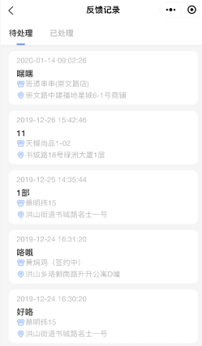
**已处理**
在【反馈记录】页面 - 点击【已处理】按钮 - 跳转至【已处理页面】- 选中需查看的【反馈记录】信息 - 点击【查看】按钮 - 可查看作业方的处理结果
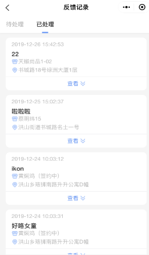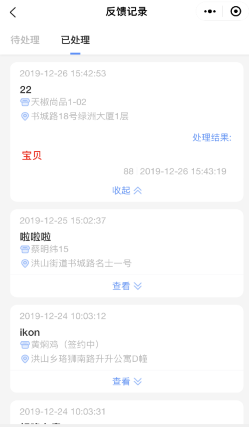

