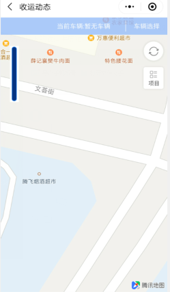
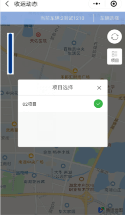
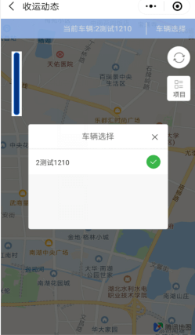
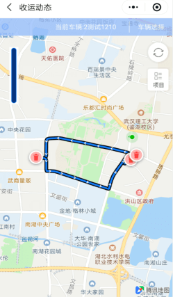

**收运动态**
为客户提供授权下的某个项目的车辆进行收运动态的展示，以及让客户查询该项目下的收运进度和收运点的详细信息，（单位名称、地址、收运时间、单位数、桶数、质量等...）

* **查询**
扫描二维码- 跳转至【收运动态】页面 - 筛选【部门】和【车辆】- 显示该车辆下的收运点的详细信息（单位名称、地址、收运时间、单位数、桶数、质量）

* **刷新**
点击进度条上方的【刷新】按钮后，可重新刷新地图
