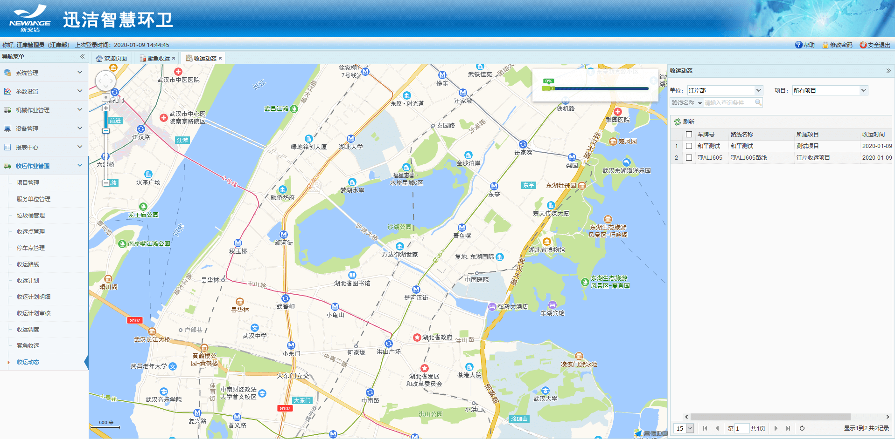
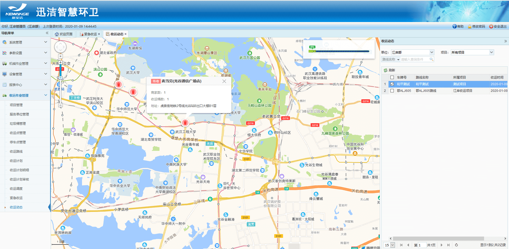

**收运动态**
在地图上展示某个项目下收运路线中已绑定的收运点（电子围栏或者单个收运点图标），点击电子围栏或者收运点图标，显示该收运点的收运详情（收运点名称、商户信息、收运桶数、质量等），同时在地图右上角显示当前作业车辆的收运进度。
app端和web端都会同步显示

* **查询收运动态**
可通过单位下的部门、项目、项目名称以及车牌号进行查询
* **查看收运动态**
勾选一辆车 - 地图展示该项目下的所有收运点图标 - 点击【收运点图标】- 弹出【收运点】的详细信息 - 点点击【×】按钮，即可关闭收运点
注：查看右上角，可看到该车辆的收运进度

