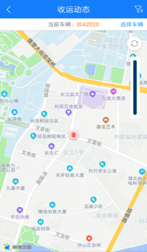
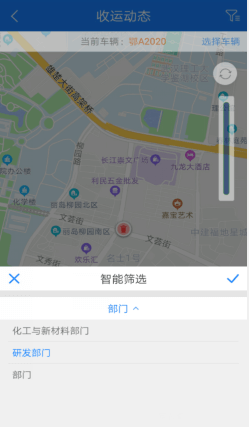
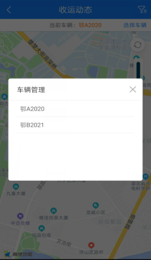
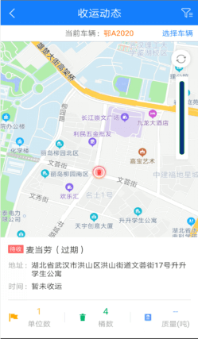

**收运动态app**
在地图上展示某个部门下收运路线中已绑定的收运点（电子围栏或者单个收运点图标），点击收运点图标，显示该收运点的收运详情（收运点名称、商户信息、收运桶数、质量等），同时在地图右上角显示当前作业车辆的收运进度。
app端和web端都会同步显示

* **查询**
点击【收运动态】- 跳转至【收运动态】页面 - 筛选【部门】和【车辆】- 显示该车辆下的收运点的详细信息（单位名称、地址、收运时间、单位数、桶数、质量）

* **刷新**
点击进度条上方的【刷新】按钮后，可重新刷新地图