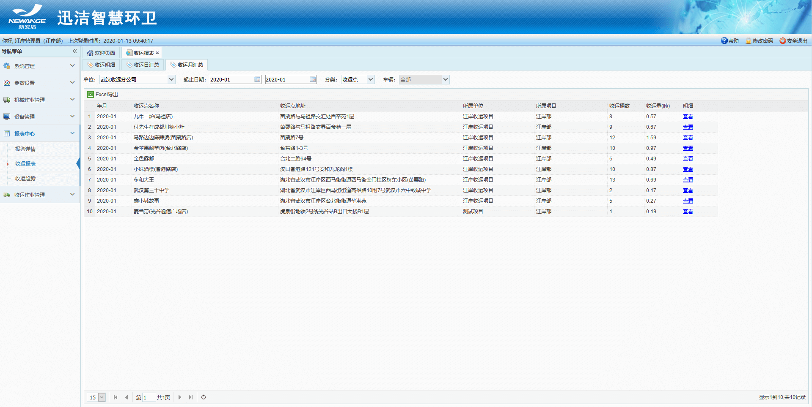
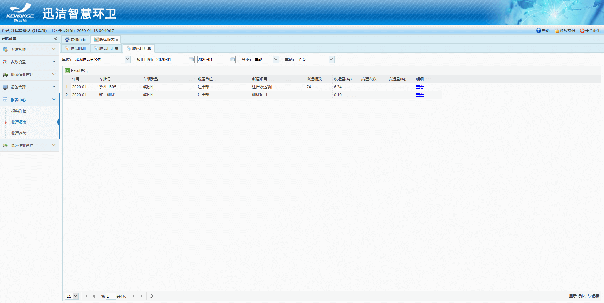
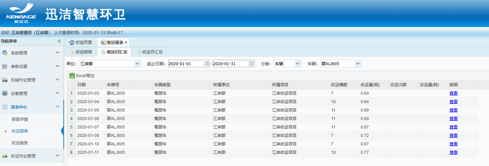
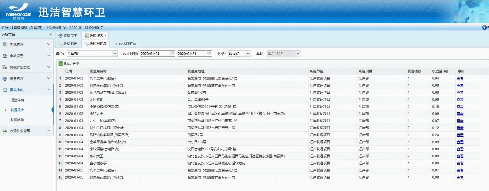
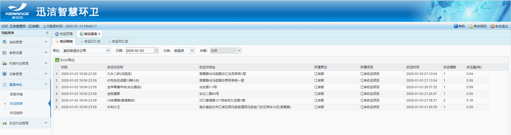
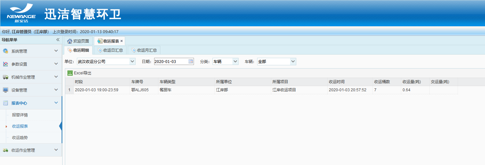

* **收运报表**
1.共3张报表：收运明细、收运日汇总、收运月汇总。
**收运月汇总**
显示当月收运情况汇总，可以根据收运点进行汇总，也可以根据车辆进行汇总，展示收运桶数、收运量（吨）；点击明细列查看，可以查看当日车辆或者收运点明细。

**收运日汇总**
按天根据车辆或者收运点进行汇总，查看某天的或者某段时间内的收运量，可查看收运明细

**收运明细**
根据车辆或者收运点展示收运明细

