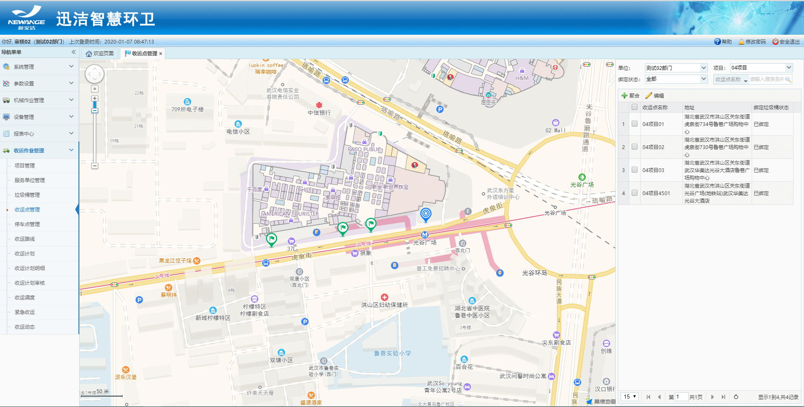
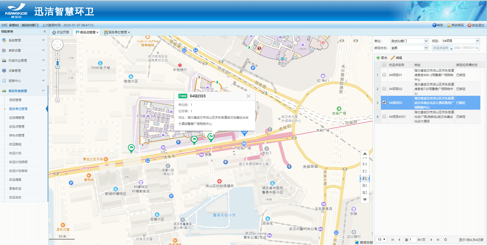
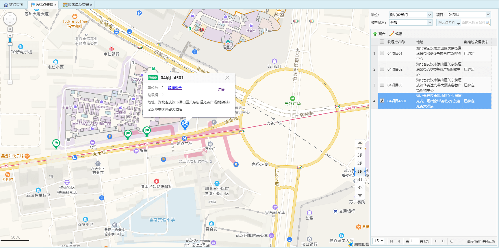
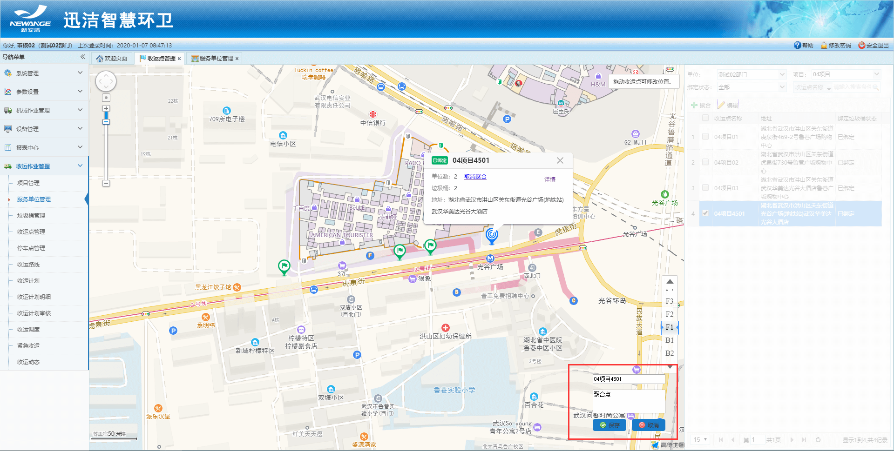
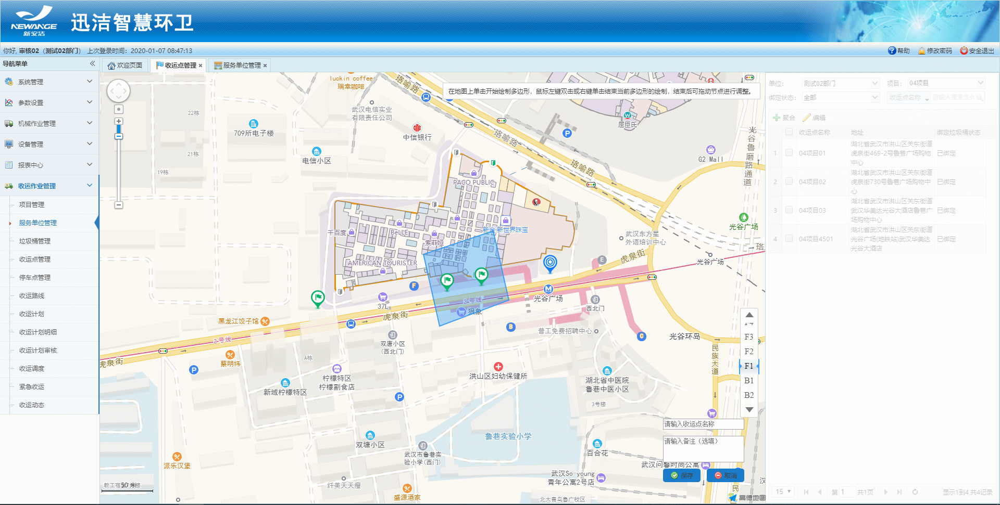
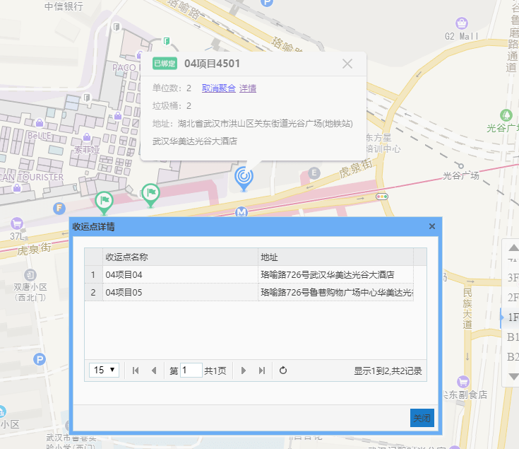
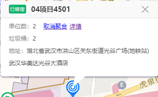

收运点管理：
1.默认以一个服务单位为一个收运点在地图上展示；
2.若存在多个服务单位使用一个收运点的情况，则需要在地图上将收运点进行聚合；
3.地图上的小图标：灰色均是未绑定垃圾桶的收运点，绿色（单个服务单位对应一个收运点）或者蓝色（多个服务单位对应一个收运点，简称聚合点）均是已经绑定了垃圾桶的收运点。
4.收运点管理：只能对收运点进行编辑和聚合。不允许添加和删除，如需添加或者删除，则在【服务单位管理】添加或者删除服务单位即可。
5.非聚合点的收运点，在编辑时，收运点名称和服务单位名称始终保持一致，即修改了收运点名称，服务单位名称也会修改，修改了服务单位名称则收运点名称也跟着改变。地址则互不影响。

* **地图展示收运点**

* **编辑收运点**
输入收运点名称、备注，在地图上拖动收运点图标到目标位置，然后点击保存即可。

* **聚合收运点**
点击聚合，然后在地图上点击将要聚合的收运点框起来，然后右键点击新的地址也 就是设置聚合点，输入聚合点名称，点击保存即可。
 
* **查看聚合点详情**
点击地图上的聚合点，可以查看详情，展示该聚合点的多个收运点信息。

* **取消聚合**
点击聚合点，地图上展示聚合点的信息，点击取消聚合，则聚合点恢复最初的多个收运点。
