**收运点管理**
1.默认以一个服务单位为一个收运点在地图上展示；
2.若存在多个服务单位使用一个收运点的情况，则需要在地图上将收运点进行聚合；
3.地图上的小图标：灰色均是未绑定垃圾桶的收运点，绿色（单个服务单位对应一个收运点）或者蓝色（多个服务单位对应一个收运点，简称聚合点）均是已经绑定了垃圾桶的收运点。
4.收运点管理：只能对收运点进行编辑和聚合。不允许添加和删除，如需添加或者删除，则在【服务单位管理】添加或者删除服务单位即可。
5.收运点绑定垃圾桶，垃圾桶上贴有RFID标签，标签上自带二维码，一个收运点可以绑定多个垃圾桶
**RFID标签**
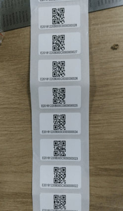
* **地图展示收运点**
进入收运点管理，首先选择一个项目，地图上加载该项目下的收运点。
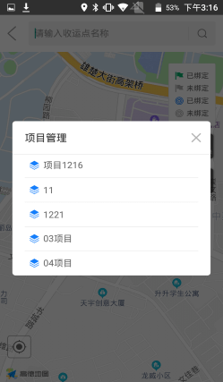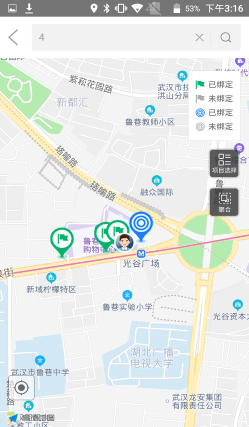
* **编辑收运点**
输入收运点名称、备注，在地图上拖动收运点图标到目标位置，然后点击【完成】即可。
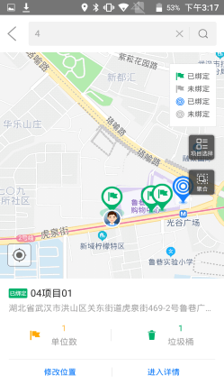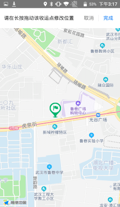
* **聚合收运点**
点击聚合，然后在地图上点击将要聚合的收运点框起来，然后在区域内点击新的地址也 就是设置聚合点，输入聚合点名称，点击完成即可。
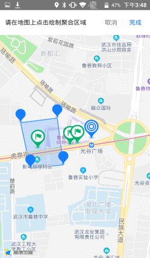
* **绑定垃圾桶**
点击收运点详情，查看垃圾桶，可以绑定新桶，点击扫一扫，扫描RFID标签上的二维码，可以一次性扫描多个二维码，扫描完成后，关闭扫一扫，可以看到RFID标签的个数，点击确定可以直接绑定垃圾桶。
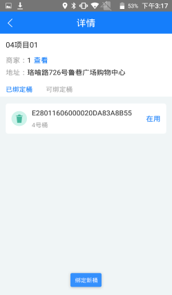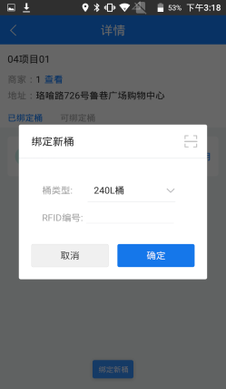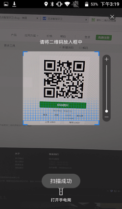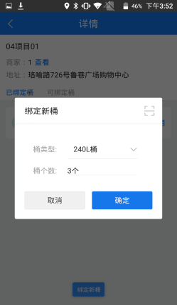

* **解绑垃圾桶**
可以通过修改垃圾桶的状态来解绑垃圾桶，点击垃圾桶，弹出改变垃圾桶状态的选择框，选择闲置或者废弃，点击确定，则解绑垃圾桶成功。注意：闲置状态下的垃圾桶可以被其他收运点在【可绑定桶】里重新绑定；而废弃状态下的垃圾桶无法再次使用。
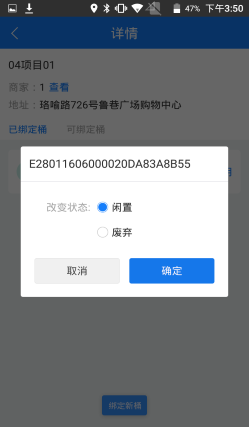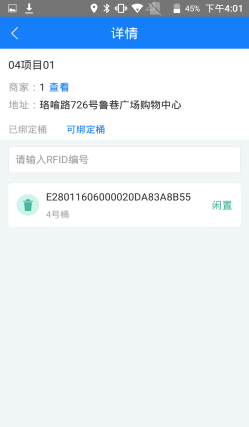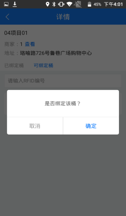

* **查看聚合点详情**
点击地图上的聚合点，可以查看详情，展示该聚合点的多个收运点信息，多少个垃圾桶信息，也可以修改聚合点的位置。
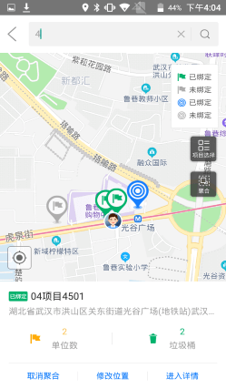

* **取消聚合**
点击聚合点，地图上展示聚合点的信息，点击取消聚合，则聚合点恢复最初的多个收运点。

