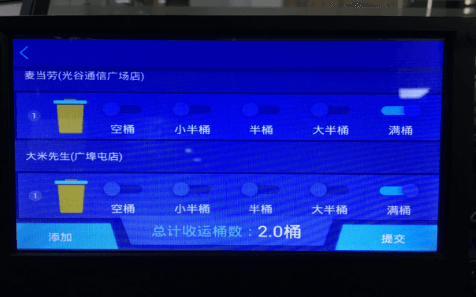

1. 司机录入指纹
2. 查看今日计划
3. 司机指纹打卡
4. 点击开始作业
5. 收运：RFID感应器感应到垃圾桶上的RFID标签，车载终端会自动弹出收运页面，选择桶容量，点击提交；
6. 下一个收运点进行收运……
7. 交运：点击结束作业，输入进场质量、出厂质量，点击确认
## **收运管理**
* **司机录入指纹**
按下车载终端电源键，点击【进入机械作业】，点击【录入指纹】，输入司机的工号，点击确定，按下指纹，会提示：指纹录入成功。一个司机最多可录入5个指纹。

* **查看今日计划**
今日计划展示当天该车辆的收运计划和收运调度。

* **司机指纹打卡**

* **开始作业和收运**
选择一个时段的路线，点击【开始作业】按钮，会提示您已开始作业，按钮变成红色的【结束作业】。
开始作业后，当RFID读写器感应到垃圾桶上的RFID标签，车载终端会自动弹出收运页面，选择桶容量，点击提交。

* **交运**
请查看下一章节《交运管理》