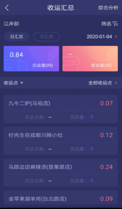

**收运汇总**
1.可以查看该部门下的收运日汇总（可选择日期）：交运量日汇总和收运量日汇总，可以根据车辆或者收运点进行查询
2.可以查看该部门下的收运月汇总（可以选择月份）：交运量日汇总和收运量日汇总，可以根据车辆或者收运点进行查询
3.点击【筛选】，可以查看其它部门下的收运汇总；
4.点击【综合分析】，可以查看当前部门下的签约覆盖率、有效签约覆盖率、收运覆盖率、日收运完成率、月实际交运率。点击【筛选】可以查看其它部门下的收运综合分析。
**签约覆盖率**：该部门下所有项目的已签约的服务单位 **/** 所有服务单位数。
**有效签约覆盖率**：该部门下所有项目的有效签约（且签约未过期）的服务单位 **/** 所有服务单位数。
**收运覆盖率**：存在在执行收运计划的服务单位数 **/** 所有服务单位数。
**日收运完成率**：当前月份交运间隔48小时内的服务单位总数 **/** 所有服务单位数。
**月实际交运率**：当前已完成的收运的店面总数 **/** 存在收运计划的服务单位总数。

