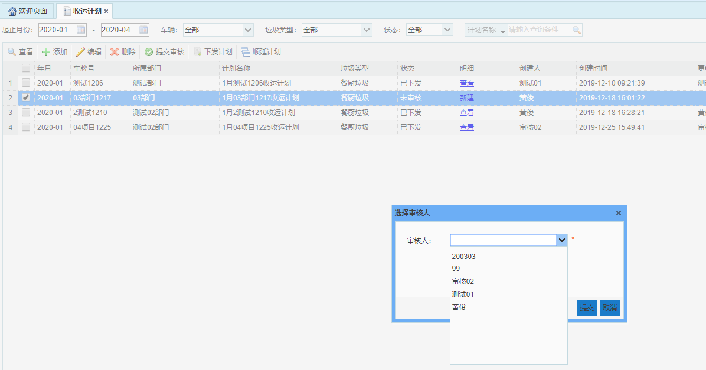

收运计划：1.一个车辆只能回收一种垃圾类型；
2.收运计划是制定一个车辆的一个月的收运计划；
3.项目助理制定计划后，提交给项目经理审核，审核通过后，项目助理来下发计划；
4.计划的五种状态：未审核、审核中、审核通过、审核失败、已下发。
5.计划下发后，迅洁app可以查看收运计划；车载终端可以查看该车辆的今日收运计划。
6.收运计划模块主要是对每辆车辆制定月计划，并对车辆的月计划进行提交审核和下发的管理，包括对收运计划进行查看、添加、编辑、删除、提交审核，下发计划以及顺延计划等功能。

* **添加收运计划**
选择一个车辆，点击【添加】按钮，弹出添加作业计划对话框，选择垃圾类型和月份，输入备注，点击【保存】按钮即可。

* **查看收运计划**
选中一条收运计划，点击【查看】按钮，弹出查看收运计划对话框，  即可查看该收运计划的基本信息。

* **编辑收运计划**
选中一条收运计划，点击【编辑】按钮，弹出编辑车辆作业计划对话框，即可对该车辆作业计划的备注进行编辑。其中，年 月是无法编辑的，垃圾类型也是不可编辑的。
备注：只能编辑状态为‘未审核’或‘审核失败’的作业计划。

* **删除收运计划**
选中一条收运计划，点击【删除】按钮，弹出确认框，点击【确定】按钮，即可删除该条车辆作业计划。
备注：只能删除状态为‘未审核’的作业计划。
* **提交审核**
选中一条收运计划，点击【提交审核】按钮，弹出选择审核人的页面，选择一个审核人，点击确定，该审核人如果登录了迅洁app，此时会收到一条消息推送：您有一条计划待审核。
备注：只能提交状态为‘未审核’或‘审核失败’的作业计划。

* **下发计划**
选中一条收运计划，点击【下发计划】按钮，弹出“下发成功”提示框。
备注：只能对状态为‘审核通过’的收运计划进行下发。

* **顺延计划**
选中一条收运计划，点击【顺延计划】按钮，弹出“顺延成功”提示框，则自动生成该车辆下个月的收运计划，计划明细和本月的最后一天保持一致。
备注：只能顺延状态为‘已下发’或‘审核通过’的收运计划。

