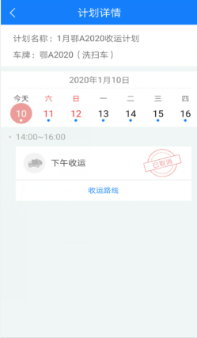

**收运计划app**
可以根据单位进行部门筛选查询相应的收运计划，点击【筛选】- 选中【单位】和【指定部门】- 显示当前部门下的所有车辆当月的收运计划 - 再点击【日期】- 显示指定日期的收运计划 - 选中需要查看的收运计划 - 点击【查看详情】- 可以查看当前日期的计划详情。
注：点击不同的日期，则显示不同日期的计划详情。

* **取消收运计划**
选中一条【收运计划】- 点击【查看详情】- 弹出【计划详情对话框】- 显示当前车辆的收运信息 - 点击【收运路线】- 跳转至【收运路线】页面 - 点击【返回】- 跳转至【计划详情】页面 - 点击【取消】按钮 - 即可取消当前车辆指定日期的收运计划。

