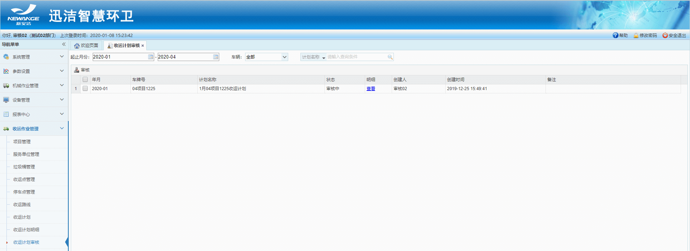
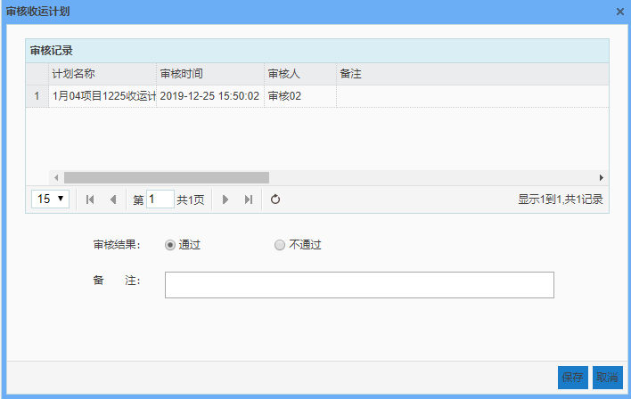

收运计划审核：1.该模块只显示提交给当前登录用户审核的收运计划。
2.审核结果默认为通过，

* **审核**
  查看该车辆的计划名称，以及计划明细，是否合理。选中这条计划，点击审核

选择审核结果，输入备注信息，点击保存即可。
如果审核通过，作业计划的状态为：审核通过。
如果审核不通过，此时作业计划的状态为：审核失败。审核失败的计划需由计划主管重新编辑计划，重新提交审核。
* **查看计划明细**
列表右侧的明细列，点击查看，可以查看该计划的所有明细。