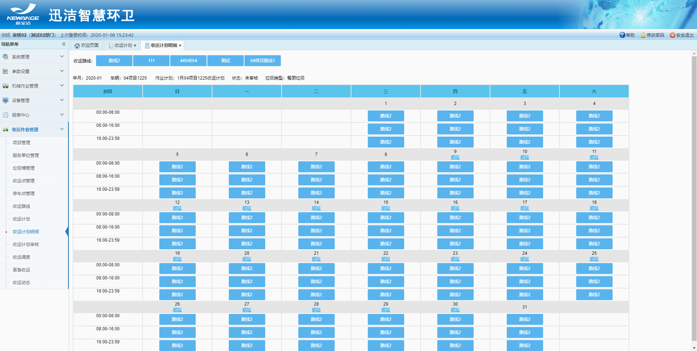
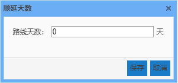
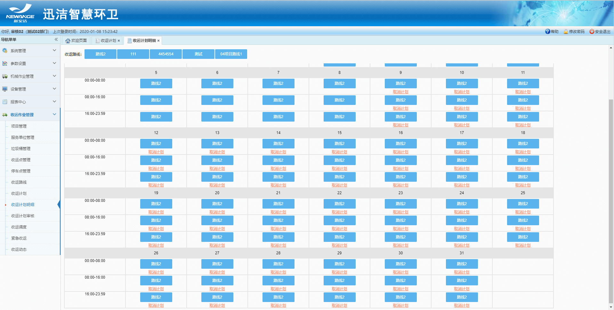

 收运计划明细：1.只能通过收运计划的新建或查看按钮跳转至计划明细。
2.日历形式展示该车辆的月度收运计划，该车辆在某个作业时段内，走哪条或哪几条收运路线。
3.制定计划明细，只需将路线拖入日历框内。如果后续的某天与前一天计划一直，则可点击当日的计划的顺延按钮，输入顺延天数，日历内的路线将自动填充。

             
注意：计划明细每天的计划都要排满，否则计划无法提交审核
 计划下发后，可以取消未来（计划的开始时间晚于当前时间）的计划。迅洁app端也可以取消计划。
