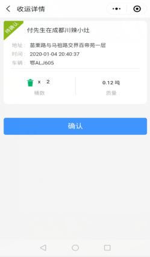

**收运记录**
作业方根据收运计划对收运点的垃圾桶进行收运后，会产生一条【待确认】的收运记录，合作方可对当天的收运记录进行查看并确认。
注：也可根据查询指定的时间，对某天的收运记录进行查看和确认。
* **待确认**
点击【收运记录】- 跳转至【收运记录】的‘待确认’框 - 可查看该服务单位的单位名称、地址、收运时间和收运量 - 点击某条【收运记录】信息 - 跳转至【收运详情】页面 - 可查看该服务单位某天的收运详情，并对该收运记录进行确认。

* **已确认**
在【收运记录】中‘待确认’的收运信息，确认后 - 会跳转至【已确认】页面 - 产生一条‘已确认’的【收运记录】信息 - 点击已确认的【收运记录】- 跳转至【收运详情】页面 - 可查看该条【收运记录】的收运详情
