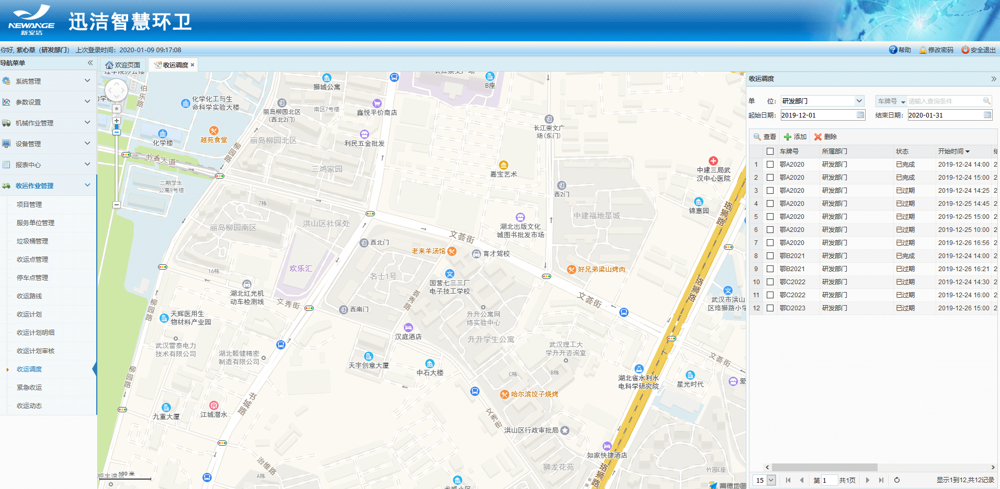
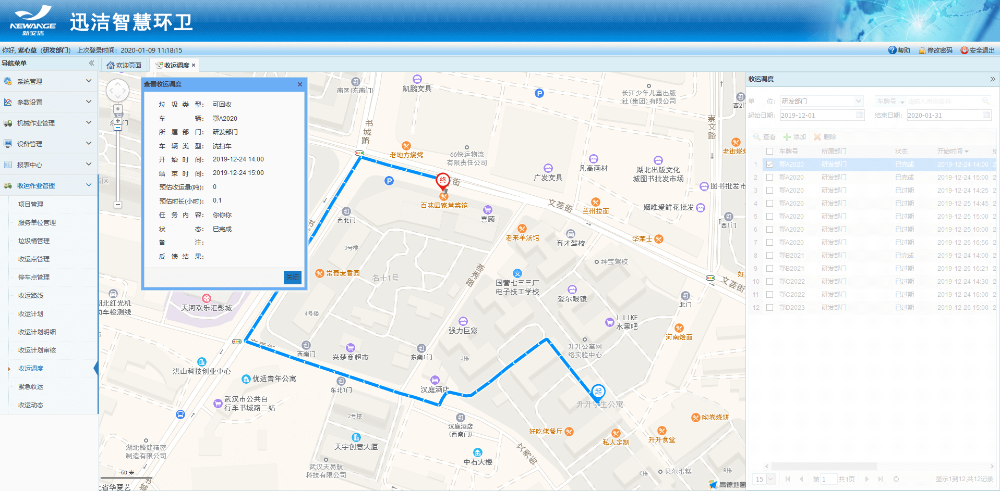
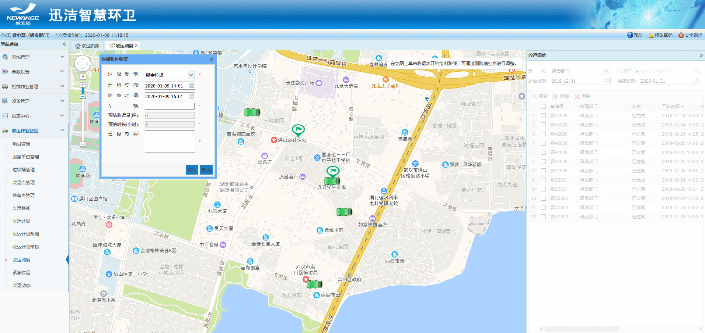
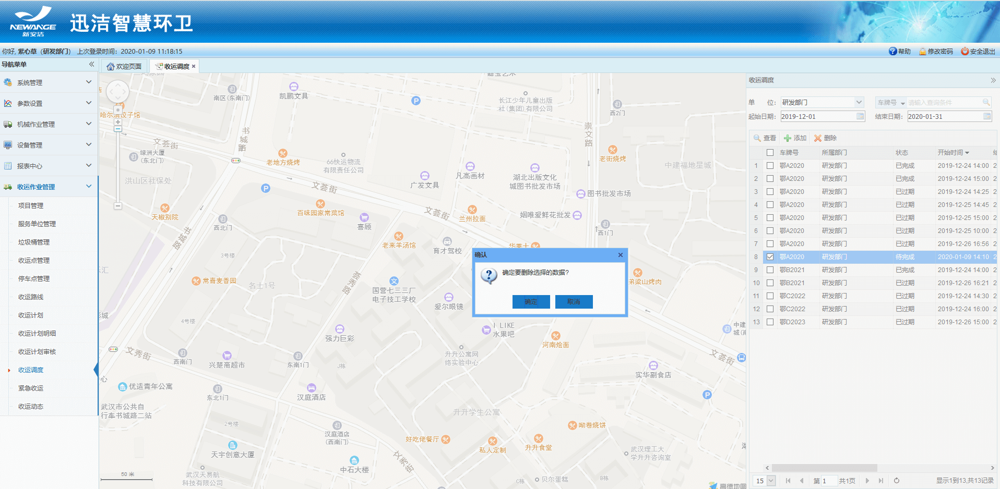

**收运调度**
收运调度是作业方根据紧急收运请求创建调度，临时调动车辆、并且制定临时路线和时间，来处理紧急收运请求，可对调度车辆实现查看、添加、删除等功能。
在app端和车载app端都会同步显示
收运调度的四种状态：未完成，已开始，已完成，已过期
创建完收运调度后，收运调度的状态为：未完成
在时段内，点击开始作业，收运调度的状态为：已开始
在时段内，点击结束作业，收运调度的作业为：已完成
在创建的时段已过去时，收运调度的状态为：已过期。

* **查看收运调度**
右侧列表中勾选中一条需要查看的【收运调度】，点击【查看】按钮 - 收运路线以绿色的形式展现在地图中心区 -- 查看【收运度对话框】显示收运调度的详情信息 - 点击【关闭】按钮，即可退出查看  
备注：只有退出查看状态后，才可进行其他操作。

* **添加收运调度**
点击【添加】按钮 - 地图区域中弹出【添加收运调度对话框】- 选中垃圾类型、开始时间、结束时间、车辆设置为起点、收运点设置为终点 ，并填写任务内容 - 点击【保存】按钮，即可完成收运调度的添加。
注：只能直接绘制临时路线

* **删除收运调度**
右侧列表中勾选中一条需要删除的【收运调度】- 点击【删除】按钮 - 弹出【确认框】- 点击【确定】按钮，即可删除该收运调度数据。
注：只能删除未完成的收运调度记录

