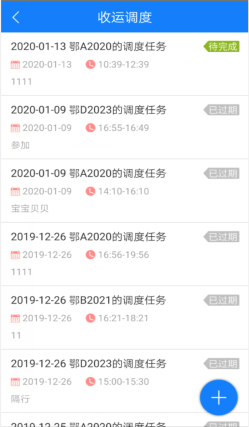
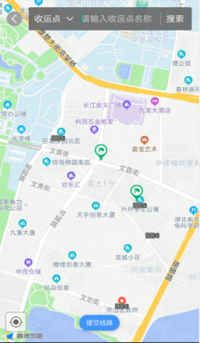
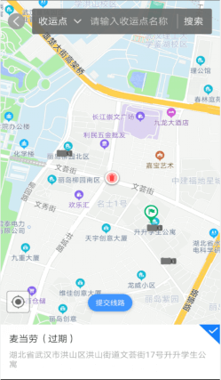
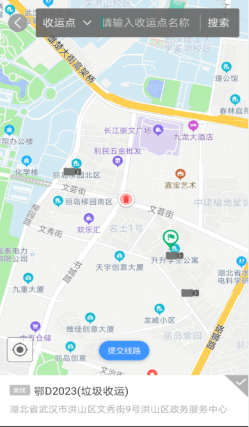
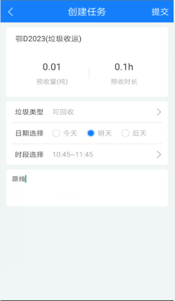
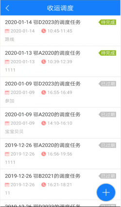
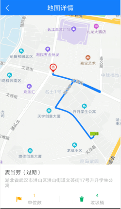

**收运调度app**
收运调度是作业方根据紧急收运请求创建调度，临时调动车辆、并且制定临时路线和时间，来处理紧急收运请求，可对调度车辆实现查看、添加、删除等功能。
在app端和车载app端都会同步显示
收运调度的四种状态：未完成，已开始，已完成，已过期
创建完收运调度后，收运调度的状态为：未完成
在时段内，点击开始作业，收运调度的状态为：已开始
在时段内，点击结束作业，收运调度的作业为：已完成
在创建的时段已过去时，收运调度的状态为：已过期。

* **查询**
点击【收运点或车辆】- 填写【收运点名称或车牌号】- 点击【搜索】按钮 - 地图中显示搜索到的【收运点或车辆】- 点击地图中的【收运点图标或车辆图标】- 可查看收运点和车辆的名字和地址。
* **添加收运调度**
点击【加号】按钮 - 跳转至地图页面 - 选中车辆和收运点 - 点击【提交线路】按钮 - 跳转至【创建任务】页面 - 填写垃圾类型、日期、开始时间-结束时间、备注 - 点击【提交】按钮，即可完成收运调度的添加。
注：只能直接绘制临时路线

* **查看收运调度**
点击某一条需要查看的【收运调度】- 跳转至【调度详情】页面 - 点击【查看】按钮 - 跳转至【地图详情】页面 -   
备注：只有退出地图详情后，才可进行其他操作。

