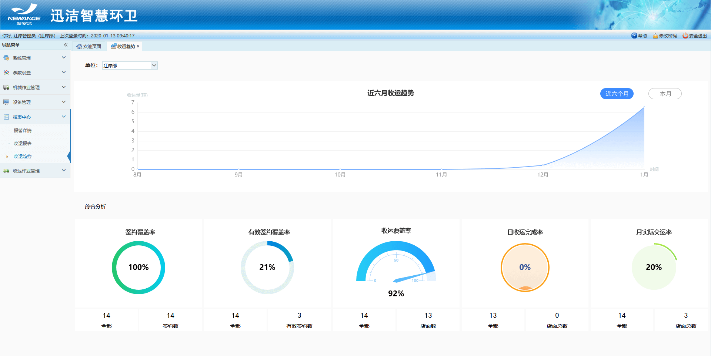
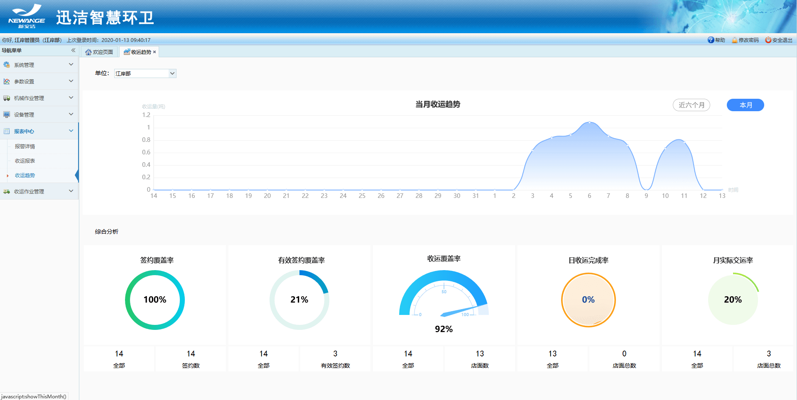

* **收运趋势**
1.展示当前登录用户所在部门的收运趋势；
2.显示近6个月收运趋势，点击本月可以查看本月的收运趋势；
3.综合分析：签约覆盖率、有效签约覆盖率、收运覆盖率、日收运完成率、月实际交运率。
**签约覆盖率**：该部门下所有项目的已签约的服务单位 **/** 所有服务单位数。
**有效签约覆盖率**：该部门下所有项目的有效签约（且签约未过期）的服务单位 **/** 所有服务单位数。
**收运覆盖率**：存在在执行收运计划的服务单位数 **/** 所有服务单位数。
**日收运完成率**：当前月份交运间隔48小时内的服务单位总数 **/** 所有服务单位数。
**月实际交运率**：当前已完成的收运的店面总数 **/** 存在收运计划的服务单位总数。

