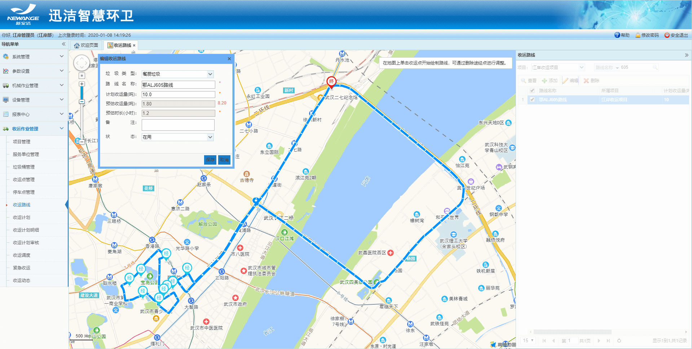

收运路线：用于规划车辆的收运行驶路线，起点、终点、途径的收运点。可以根据路线距离，收运点垃圾桶容量及个数来预估路线的收运量及整条收运路线所耗费的时间。可以为后续收运计划的制定提供依据。
1.添加收运路线、编辑、查看、删除、查询的功能。
2.收运路线只展示当前登录用户所属部门下的所有项目下的收运路线。
3.收运路线最多支持16个收运点（也就是途径点），高德地图的限制。
4.地图上绘制路线时，要选择停车点右键点击图标，设为起点、设为终点，然后选择收运点右键点击图标设置为途径点。
5.一条收运路线只能回收一种类型的垃圾。

* **添加收运路线**
点击添加，选中垃圾类型，输入路线名称，计划收运量（预计车辆能装多少吨这种类型的垃圾），然后在地图上绘制路线，绘制方法查看第4点。绘制完成后，**预估收运量**和**预估时长**则自动计算出来。
预估收运量后红色提示数字表示：该条路线距离计划收运量还可以收运多少吨。
**预估收运量**=所有收运点的**垃圾桶容量*****桶数** ***垃圾类型的密度**
**预估时长**=**单桶收运时间** * **桶数**+**整个路线的行驶时间**（高德地图返回的时间）

* **编辑收运路线**
可以修改计划收运量、在地图上添加收运点、修改路线起点或终点。

* **查看收运路线**
右侧列表选中一个收运路线，点击查看。

* **删除收运路线**
选中一个收运路线，点击删除即可。
* **查询收运路线**
可根据项目进行筛选，也可输入路线名称进行模糊查询。
