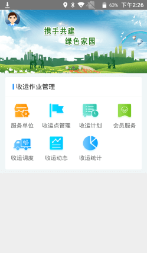
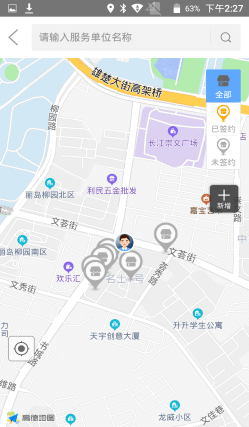
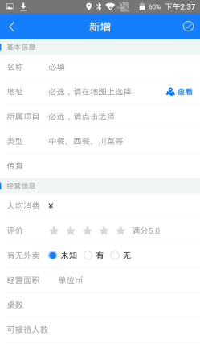
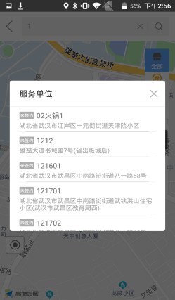
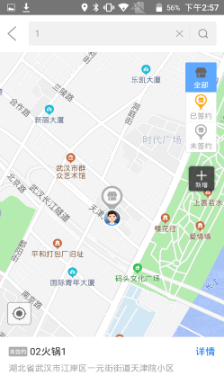
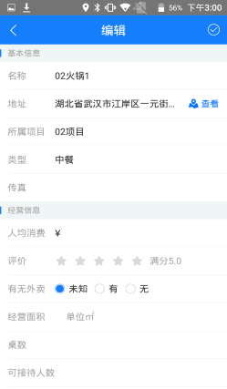
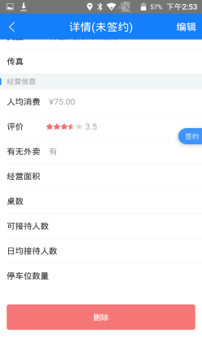
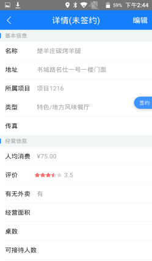
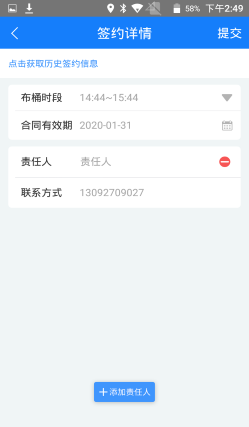
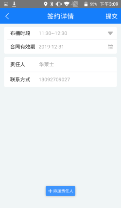

**服务单位**
1.在地图上展示该部门下所有的服务单位，根据全部、已签约、未签约进行筛选；
2.可以在地图上新增服务单位，并进行签约绑定责任人；
3.可以编辑服务单位的基本信息和经营信息；
4.可以在地图搜索框内输入服务单位名称快速定位到该服务单位；
5.可以查看服务单位的签约历史；
6.未签约的服务单位可以删除；
7.签约过期的服务单位也可以重新签约；

**新增服务单位**
在地图上点击新增按钮，输入服务单位的基本信息：名称、地址、所属项目、类型等和经营信息，点击右上角提交即可。
**编辑服务单位**
在地图上点击服务单位小图标或者在搜索框内搜索，选择一个服务单位，点击详情，点击编辑，编辑完成后点击提交即可。

**删除服务单位**
选择一个服务单位，点击详情，点击编辑，将页面划到最底部，点击删除即可。
注意：只能删除未签约的服务单位。

**签约**
选择一个服务单位，点击右侧中间的签约按钮，输入布桶时段、合同有效期，并且添加责任人，输入责任人姓名和联系方式，点击提交则签约成功。一个服务单位最少要有一个责任人，也可添加多个责任人，责任人登录微信小程序可以查看收运记录、上报紧急收运以及查看我的信息。（详情请查看微信小程序）

**历史签约**
如果服务单位的签约过期了，可以再次签约，再次签约时可以重新签约也可以获取历史签约信息选择合同有效期后直接提交进行签约，前提是责任人没有变动的情况下可以直接提交。如果有变动则建议重新输入布桶时段、合同有效期及责任人点击提交。
