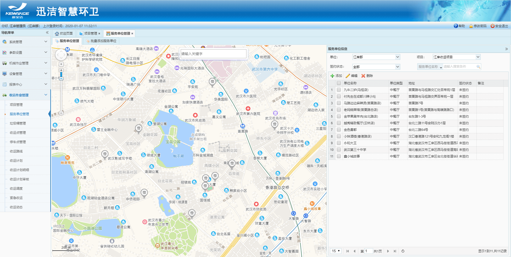
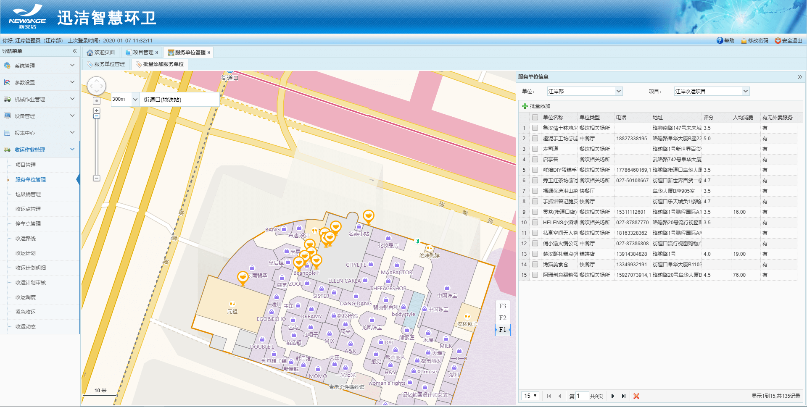
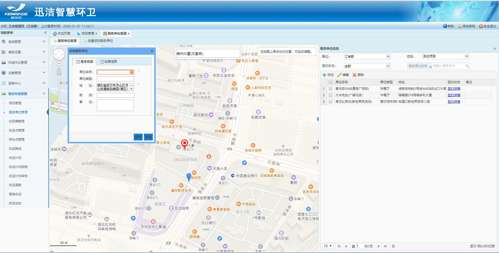
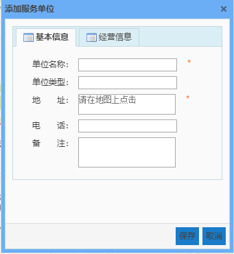
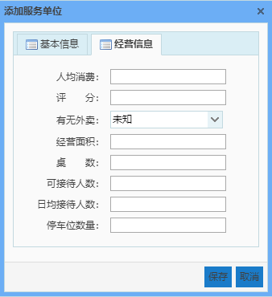
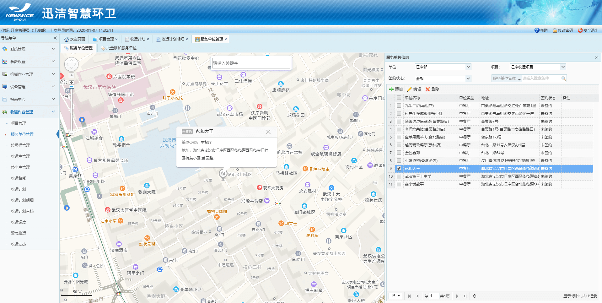
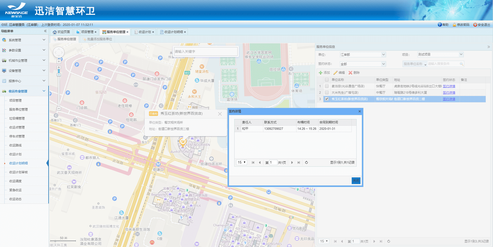
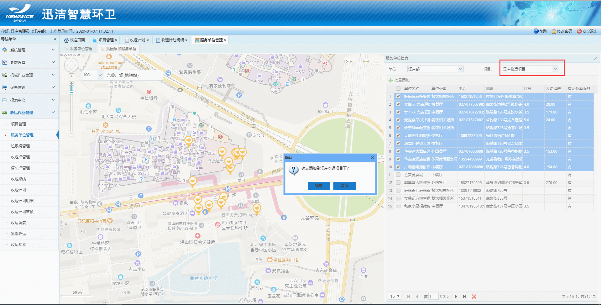
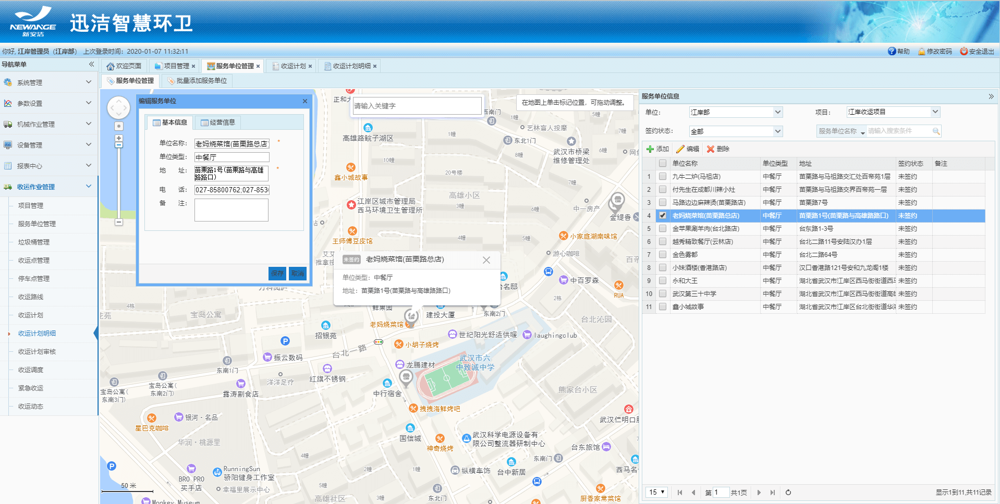

主要是对收运作业项目下的服务单位进行管理，包括添加、编辑、删除和地图查看等操作，以列表和地图的形式展示。
也可以批量添加服务单位；
服务单位管理分两个tab页面：1.服务单位管理：在地图上定位直接添加服务单位，也可在搜索框内输入服务单位名称快速搜索定位来添加服务单位；2.批量添加服务单位：首先在项目下拉框中选择一个项目，在搜索框内输入地址，选择左侧的搜索半径，该地址半径范围内的所有服务单位均在地图上展示，右侧列表也会显示，选中多个（不超过10个）点击批量添加，即可将这些服务单位添加到该项目下。
**注意：签约状态：未签约和已签约。签约只能在迅洁app端的服务单位模块进行操作。**

* **添加服务单位**
需输入基本信息和经营信息。

   

* **查询服务单位**
可以根据单位、项目、签约状态、服务单位名称进行搜索。
列表中选中一个服务单位，左侧地图将自动定位到该服务单位，并且展示该服务单位的地图信息框。

* **查看签约详情**
已签约的服务单位，会显示签约详情，点击签约详情，
弹框提示该服务单位的签约责任人（可以有多个），布桶时间、合同到期时间。

* **批量添加服务单位**
首先在项目的下拉框中选择一个要批量添加服务单位的项目，然后在地图上搜索某个地址，选择地址半径，改地址半径范围内的所有服务单位自动加载出来，多选，然后点击批量添加，则这些服务单位全部添加到该项目下。

* **编辑服务单位**
选中一个服务单位，地图自动定位该服务单位，弹出编辑框，输入保存即可。

* **删除服务单位**
选中一个项目，点删除即可。
