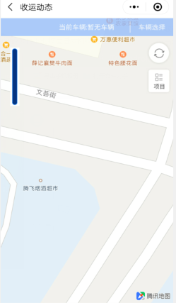
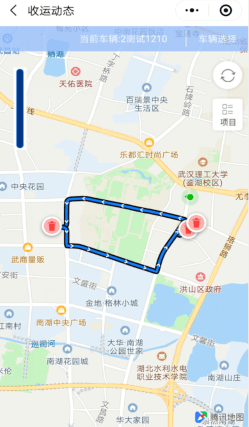

**微信小程序**
合作方通过扫描微信小程序二维码，进入【登陆页面】- 可使用客户或者会员的身份进行登录 - 选中用户类型【客户/会员】- 填写【手机号】- 点击【发送二维码】- 填写二维码 - 点击立即登录 - 即可登录成功

* **客户**
在客户管理里只显示有客户角色的用户，客户的添加需在用户管理里，添加好后需授权为客户角色，才会在客户管理里显示
注：在用户管理里添加的用户类型属于客户，则该客户自动在该列表展示
**收运动态**
 客户登录后，只可查看收运动态模块
注：客户识别的是微信号，如果在用户管理中编辑客户的手机号，也还是可以成功登陆并查看授权项目的收运动态
  如果该用户没有授权任何项目，则无法查看任何收运动态；授权项目后，只能查看已授权的项目下收运路线中的收运点的收运进度和详情。

* **会员**
在【服务单位app】中进行过签约的责任人才能使用【会员】的身份进行登录 - 登录后可查看自己签约的服务单位的【我的信息】和【收运记录】- 同时能上报【紧急收运请求】和【意见反馈】

