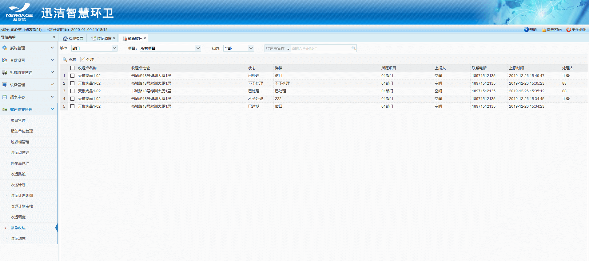
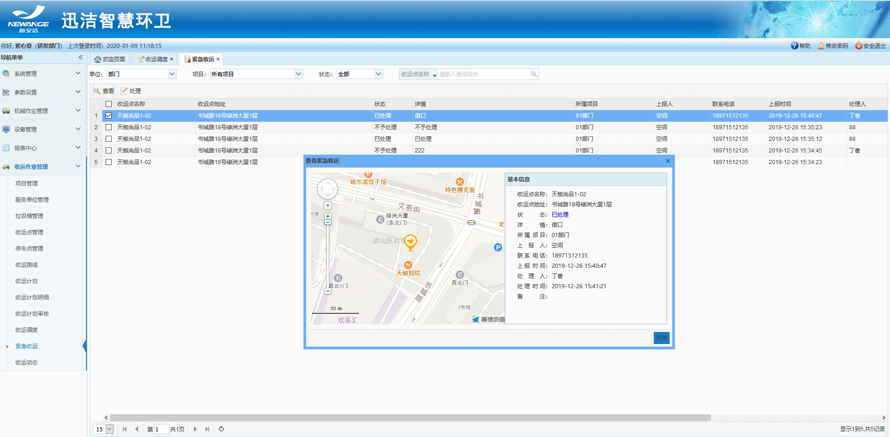
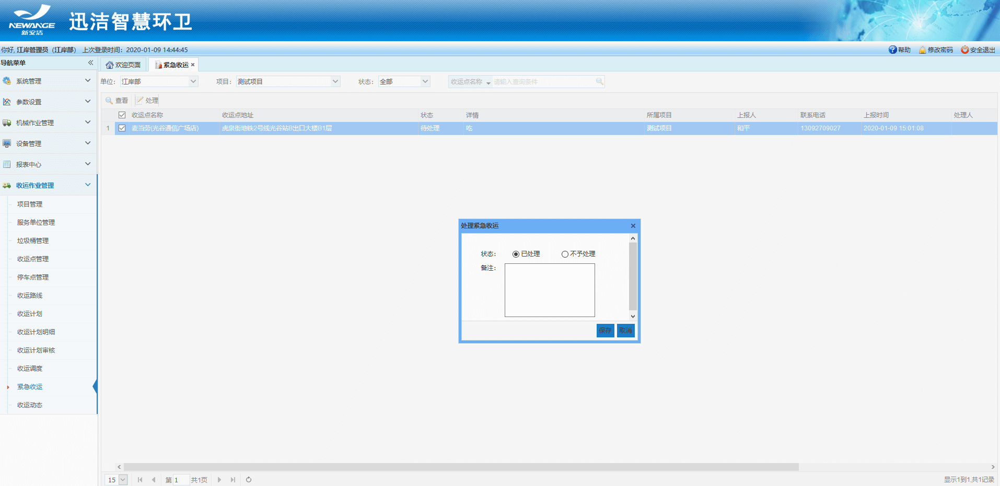

**紧急收运**
当合作方在微信小程序的紧急收运中上报过紧急收运请求，可在紧急收运模块中查看紧急收运请求并进行处理。
在app端和web端都会同步显示
紧急收运的四种状态：待处理，已处理，已过期，不予处理
合作方上报紧急收运请求后的12个小时内，紧急收运的状态为：待处理
作业方处理完紧急收运请求后，紧急收运的状态为：已处理
合作方上报的紧急收运请求在12小时内没有被处理时，紧急收运的状态会变更为：已过期
作业方处理紧急收运请求时，认为不需要处理时，紧急收运的状态为：不予处理。

* **查询紧急收运**
可根据单位的所属部门、所属项目、紧急收运状态以及收运点名称进行查询
* **查看紧急收运**
勾选一条需要查看的【紧急收运】- 点击【查看】按钮 - 弹出【查看紧急收运对话框】- 可查看紧急收运的详细信息 - 点击【关闭】按钮 - 即可退出查看

* **处理紧急收运**
勾选一条需要处理的【紧急收运】- 点击【处理】按钮 - 弹出【处理紧急收运对话框】- 选中处理的状态，填写备注 - 点击【保存】按钮 - 即可处理一条紧急收运请求
注：只能处理未处理的紧急收运请求记录
