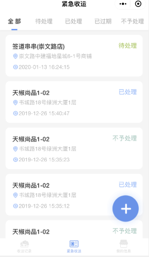
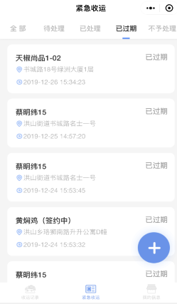

**紧急收运**
点击【紧急收运】- 跳转至【紧急收运】页面，可查看签约后的服务单位上报的紧急收运请求和处理情况
注：当合约到期后，无法上报紧急收运请求
* **全部**
展示该会员下已签约的所有服务单位已上报的紧急收运请求，主要分为四个状态：待处理、已处理、已过期、不予处理

* **待处理**
展示该会员下已签约的所有服务单位已上报的待处理的紧急收运请求和紧急收运详情，点击【待处理】- 跳转至【待处理】页面 - 点击某条【紧急收运请求】- 跳转至【紧急收运详情】页面 - 可查看具体处理情况

* **已处理**
展示该会员下已签约的所有服务单位已上报的已处理的紧急收运请求和紧急收运详情，点击【已处理】- 跳转至【已处理】页面 - 点击某条【紧急收运请求】- 跳转至【紧急收运详情】页面 - 可查看具体处理情况

* **已过期**
展示该会员下已签约的所有服务单位已上报的已过期的紧急收运请求和紧急收运详情，点击【已过期】- 跳转至【已过期】页面 - 点击某条【紧急收运请求】- 跳转至【紧急收运详情】页面 - 可查看具体处理情况

* **不予处理**
展示该会员下已签约的所有服务单位已上报的已过期的紧急收运请求和紧急收运详情，点击【不予处理】- 跳转至【不予处理】页面 - 点击某条【紧急收运请求】- 跳转至【紧急收运详情】页面 - 可查看具体处理情况

* **添加紧急收运**
点击【加号】按钮 - 弹出【上报紧急收运对话框】- 选中单位名称、填写备注 - 点击【提交】按钮 - 即可成功上报一条待处理的紧急收运请求
注：待处理的紧急收运请求过了12个小时后，状态会变更为：已过期的紧急收运请求

