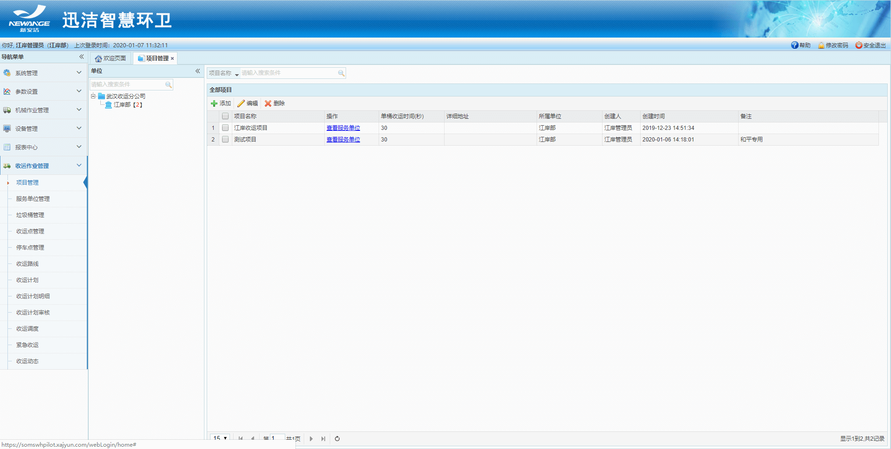
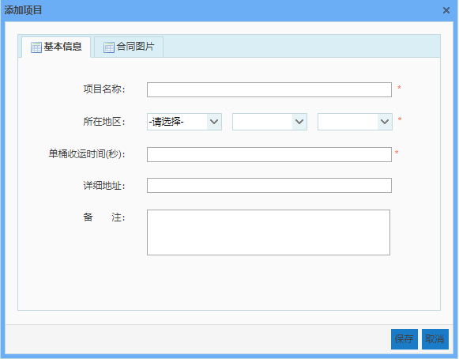
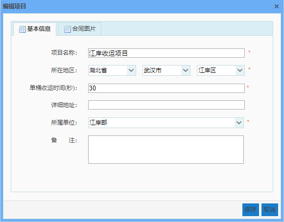
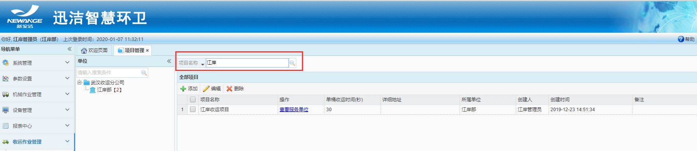

项目管理用于管理部门下的收运项目，设置项目参数等。
其主要功能有：查看、添加、编辑、删除和根据项目名称进行查询

* **添加项目**
输入项目名称、项目所在地区，单桶收运时间（用于计算一条收运路线的收运时间），详细地址，备注、合同照片，点击保存即可。

* **编辑项目**

* **删除项目**
选中一个项目，点删除即可。

* **查看服务单位**
点击可在地图上查看该项目下的服务单位。跳转至服务单位管理页面。

* **搜索项目**
当项目太多，无法快速找到，可在搜索栏中输入项目名称，点击搜索，快速查找到该项目
